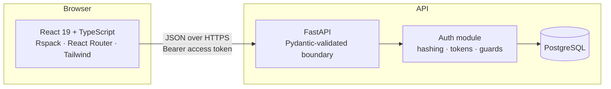
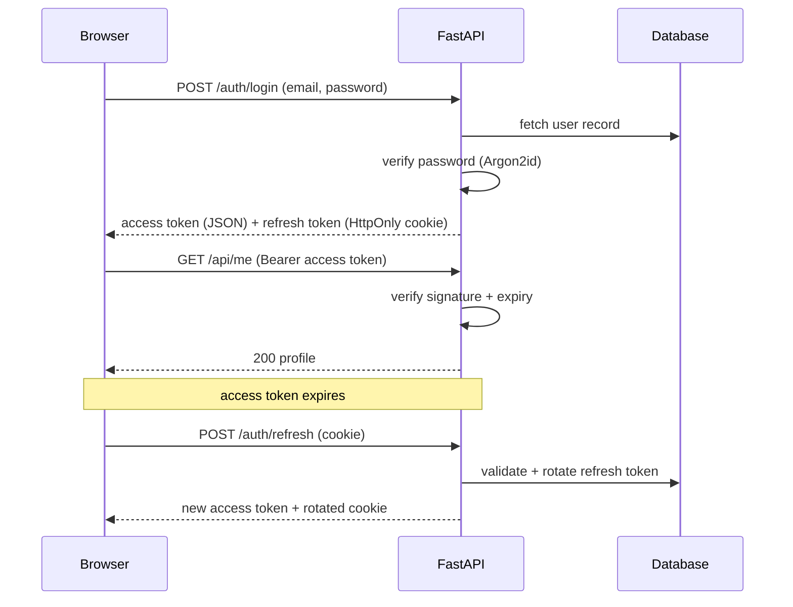

# React + FastAPI Auth Starter

> A batteries-included application template so the *next* project starts at feature work, not at boilerplate.


---

## Why this repo exists

Every new side project burns its first week on the same undifferentiated work: wiring a bundler, standing up a server, building sign-up, login, session persistence, and route guards. That work is identical across projects and yet it is where most prototypes die — the interesting idea never gets built because the scaffolding ate the motivation.

This repository is my answer to that. It is a **template, not a product**. The contract is:

1. `git clone` this repo.
2. Restyle the sample marketing/auth surfaces for the new idea.
3. Build the authenticated product surface — the actual differentiated work.

Auth design, build tooling, typing, linting, and a mobile-first landing + login/signup shell are already decided so they never have to be decided again.

---

## Project status

This is an in-progress template and the README tracks reality rather than intent. Nothing below is claimed as done until it is on `main`.

| Area | Status | Notes |
| --- | --- | --- |
| Frontend build pipeline | ✅ Done | Rspack 2 + SWC, React Fast Refresh, TS 6, ESLint 10, Prettier |
| UI foundation | ✅ Done | Tailwind CSS 4, shadcn/Base UI primitives, Coda-inspired design tokens |
| Sample marketing + auth UI | ✅ Done | Fold landing (`/`), login (`/login`), signup (`/signup`) — sample forms only |
| Routing | ✅ Done | React Router 7, SPA history fallback in Rspack |
| Backend service skeleton | ✅ Done | FastAPI app, `uv`-managed deps, lockfile committed |
| Auth — backend | 📋 Planned | Design settled (see below); implementation not started |
| Auth — frontend | 📋 Planned | Auth context, guarded routes, token refresh; wire forms to API |
| Persistence layer | 📋 Planned | Postgres + SQLAlchemy 2.0 + Alembic |
| Test suites | 📋 Planned | pytest + httpx on the backend, Vitest + RTL on the frontend |
| Containerisation & CI | 📋 Planned | Docker Compose for local parity, GitHub Actions for lint/test |

---

## Tech stack, and why

Anyone can list dependencies. The reason each one is here matters more.

| Choice | Why it beat the obvious alternative |
| --- | --- |
| **Rspack** over Vite/webpack | Rust-based bundler with a webpack-compatible config surface. Keeps webpack's loader/plugin ecosystem and mental model while removing the cold-start and rebuild cost that makes large webpack projects painful. |
| **SWC** over Babel | Transpilation happens in Rust inside the bundler — no separate JS-based transform pass in the hot path. |
| **React 19** | Current major, so the template doesn't ship a migration debt to its own clones. |
| **TypeScript** end to end on the client | The auth layer is where silent shape mismatches hurt most; types are non-negotiable there. |
| **React Router 7** | Explicit client routes for marketing vs auth surfaces without pulling in a full meta-framework. |
| **Tailwind CSS 4 + shadcn** | Utility-first styling with a small set of accessible primitives (`Button`, `Input`) instead of reinventing focus rings and variants. |
| **FastAPI** over Flask/Django | Native async, Pydantic validation at the boundary, and OpenAPI generated from the same type hints that enforce runtime validation — one source of truth for docs, validation, and the client contract. |
| **uv** over pip/Poetry | Fast resolution and a committed `uv.lock`, so every clone of this template resolves to byte-identical dependencies. |
| **Separate `frontend/` and `backend/`** | Independent deploy targets and independent dependency graphs. The frontend can go to any static host, the API anywhere that runs Python — without splitting the repo. |

---

## Architecture



The boundary between client and server is a plain JSON API. There is no server-rendered coupling, which keeps the two halves independently replaceable — swap React for anything else and the API is untouched.

### Frontend routes (current)

| Path | Surface |
| --- | --- |
| `/` | Sample landing page (Fold) |
| `/login` | Sample login form |
| `/signup` | Sample signup form |

Forms are UI-only samples until the auth API is wired.

---

## Authentication design

The design is settled even though the code is not yet written; documenting it up front is what makes the implementation mechanical.

**Token strategy — short-lived access token + rotating refresh token.**

- **Access token**: JWT, ~15 minute lifetime, sent as a `Bearer` header. Short-lived so a leaked token has a small blast radius, and stateless so the common path needs no database round trip.
- **Refresh token**: long-lived, stored in an `HttpOnly` + `Secure` + `SameSite` cookie so client-side JavaScript can never read it — this is the mitigation against token theft via XSS. Rotated on every use, with reuse detection to invalidate a stolen family.
- **Password storage**: Argon2id, the current password-hashing recommendation. Never anything from the SHA family — general-purpose hashes are designed to be fast, which is precisely the wrong property here.



**Planned surface**

| Method | Route | Purpose |
| --- | --- | --- |
| `POST` | `/auth/register` | Create account |
| `POST` | `/auth/login` | Exchange credentials for tokens |
| `POST` | `/auth/refresh` | Rotate refresh token, mint access token |
| `POST` | `/auth/logout` | Revoke refresh token family |
| `GET` | `/api/me` | Current user — the canonical protected route |

On the client, a single `AuthProvider` owns session state, a route guard component redirects unauthenticated users, and an HTTP wrapper transparently retries once through `/auth/refresh` on a `401`, so no feature code ever has to think about token expiry.

---

## Repository layout

```
.
├── backend/
│   ├── main.py                 # FastAPI application entrypoint
│   ├── pyproject.toml          # Dependencies (uv / PEP 621)
│   └── uv.lock                 # Committed lockfile — reproducible installs
└── frontend/
    ├── index.html
    ├── rspack.config.ts        # SWC, Fast Refresh, SPA history fallback
    ├── components/             # UI + layout + marketing + auth components
    │   ├── ui/                 # Button, Input, chips, …
    │   ├── layout/             # TopNav, SiteFooter, AuthLayout
    │   ├── marketing/          # Hero, mockup, CTA, …
    │   ├── auth/               # LoginForm, SignupForm, AuthField
    │   └── brand/              # Wordmark
    ├── lib/utils.ts
    └── src/
        ├── main.tsx            # React root + BrowserRouter
        ├── App.tsx             # Route table
        ├── index.css           # Design tokens + Tailwind
        ├── constants/          # Domain content (layout, marketing, workspace)
        │   ├── layout.ts
        │   ├── marketing.ts
        │   └── workspace.ts
        └── pages/              # LandingPage, LoginPage, SignupPage
```

---

## Getting started

**Prerequisites** — Node.js 22+, Python 3.12+, and [uv](https://docs.astral.sh/uv/).

### Backend

```bash
cd backend
uv sync                      # resolve from the committed lockfile
uv run fastapi dev main.py   # http://127.0.0.1:8000
```

Interactive OpenAPI docs are generated automatically at `http://127.0.0.1:8000/docs`.

### Frontend

```bash
cd frontend
npm install
npm run dev                  # http://localhost:8080
```

Open `/`, `/login`, and `/signup` to walk the sample surfaces.

### Everyday commands

| Command | Location | Purpose |
| --- | --- | --- |
| `npm run dev` | `frontend/` | Dev server with Fast Refresh |
| `npm run build` | `frontend/` | Production bundle |
| `npm run preview` | `frontend/` | Serve the production bundle locally |
| `npm run lint` | `frontend/` | ESLint |
| `npm run format` | `frontend/` | Prettier |
| `uv run fastapi dev main.py` | `backend/` | API with autoreload |
| `uv sync` | `backend/` | Install/refresh the environment |

---

## Using this as a template

1. Clone it and re-point the remote at the new project.
2. Rebrand the sample UI: tokens in `frontend/src/index.css`, copy in `frontend/src/constants/`, and the page/component tree under `frontend/src/pages/` + `frontend/components/`.
3. Keep the route shape (`/`, `/login`, `/signup`) or extend it — then wire the auth forms to the FastAPI endpoints once they exist.
4. Add feature routes behind the auth guard on the client, and feature routers behind the auth dependency on the API.
5. Everything else — build config, linting, dependency management, session design — is intended to be inherited untouched.

---

## Roadmap

- [x] Frontend toolchain: Rspack + SWC + TypeScript + ESLint + Prettier
- [x] FastAPI service skeleton with reproducible `uv` environment
- [x] Tailwind CSS 4 + shadcn/Base UI primitives
- [x] Mobile-first sample landing page + login/signup (React Router)
- [ ] Postgres + SQLAlchemy 2.0 models and Alembic migrations
- [ ] Auth endpoints: register, login, refresh, logout
- [ ] Argon2id hashing and JWT issuance/verification
- [ ] `AuthProvider`, guarded routes, transparent token refresh
- [ ] Wire sample login/signup forms to the API
- [ ] Backend tests (pytest + httpx) and frontend tests (Vitest + RTL)
- [ ] Docker Compose for local parity
- [ ] GitHub Actions running lint, type-check, and tests on every push

---

## Engineering notes

A few decisions worth stating explicitly, since a template propagates them into every project cloned from it:

- **The lockfile is committed.** A template whose dependencies drift between clones is not a template.
- **The refresh token is never readable by JavaScript.** Storing session credentials in `localStorage` is convenient and turns any XSS into full account takeover; the `HttpOnly` cookie is the whole point.
- **Validation lives at the boundary.** Pydantic models sit at the edge of the API so untrusted input is shaped and rejected before it reaches any business logic.
- **The two halves stay decoupled.** No shared build step, no server-rendered templates — either side can be rewritten or redeployed alone.
- **UI content lives in `src/constants/` by domain.** Presentational components stay in `components/`; nav/footer/marketing copy is not inlined next to JSX.
- **This README tracks what is true.** Planned work is labelled planned. A checklist that lies is worse than no checklist.
